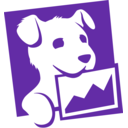
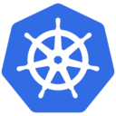
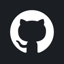

<h1 align="center">
  
</h1>
<p align="center">
  <p align="center"><b>The open-source AI SRE platform</b>: Investigate production incidents, find root causes, and suggest fixes — automatically.</p>
</p>

<h4 align="center">
  <a href="https://join.slack.com/t/incidentfox/shared_invite/zt-3ojlxvs46-xuEJEplqBHPlymxtzQi8KQ">Slack</a> |
  <a href="https://incidentfox.ai">IncidentFox Cloud</a> |
  <a href="docs/DEPLOYMENT.md">Self-Hosting</a> |
  <a href="docs/FEATURES.md">Docs</a> |
  <a href="https://www.incidentfox.ai">Website</a>
</h4>

<h4 align="center">
  <a href="https://github.com/incidentfox/incidentfox/blob/main/LICENSE">
    
  </a>
  <a href="https://github.com/incidentfox/incidentfox/blob/main/CONTRIBUTING.md">
    
  </a>
  <a href="https://github.com/incidentfox/incidentfox/issues">
    
  </a>
  <a href="https://join.slack.com/t/incidentfox/shared_invite/zt-3ojlxvs46-xuEJEplqBHPlymxtzQi8KQ">
    
  </a>
  <a href="https://twitter.com/jimmyweiiiii">
    
  </a>
</h4>


## Introduction

**[IncidentFox](https://incidentfox.ai)** is the open-source AI SRE that automatically investigates production incidents, correlates alerts, analyzes logs, and finds root causes. It connects to your observability stack, infrastructure, and code — then reasons through to an answer.

IncidentFox lives in Slack (or Microsoft Teams / Google Chat). It can auto-respond to every alert, investigate in the thread, and post a root cause summary — or you can @mention it on demand. It learns from your codebase, Slack history, and past incidents to get smarter over time.

We're on a mission to make incident response faster and less painful for every on-call engineer, not just teams with dedicated SRE staff.

## Features

### Investigation & Root Cause Analysis

- **[Auto-Investigation](docs/FEATURES.md)**: Automatically responds to every alert in Slack, investigates in-thread, and posts a root cause summary. Also supports on-demand @mention for any question.
- **[Chat-First Debugging](docs/SLACK_SETUP.md)**: Investigate incidents without leaving Slack, Microsoft Teams, or Google Chat. Upload screenshots, attach logs, and get analysis inline.
- **[Multi-Agent Orchestration](docs/FEATURES.md)**: Specialist agents for Kubernetes, AWS, metrics, code analysis, and more — routed automatically based on the problem.
- **[Smart Log Sampling](docs/FEATURES.md)**: Statistics first, then targeted sampling. Stays useful where other tools hit context limits.
- **[Alert Correlation](docs/FEATURES.md)**: 3-layer analysis (temporal + topology + semantic) reduces alert noise by 85-95%.
- **[Anomaly Detection](docs/FEATURES.md)**: Meta's Prophet algorithm with seasonality-aware forecasting. Detects anomalies that account for daily/weekly patterns.
- **[Dependency Mapping](docs/FEATURES.md)**: Automatic service topology discovery with blast radius analysis.
- **[Knowledge Base (RAPTOR)](docs/FEATURES.md)**: Hierarchical retrieval over runbooks and docs. Maintains context across long documents where standard RAG fails.
- **[Continuous Learning](docs/FEATURES.md)**: Learns from every investigation. Persists patterns and builds team-specific context over time.

### Integrations

| Category | Integrations |
|----------|-------------|
| **Logs & Metrics** |  Coralogix ·  Grafana ·  Elasticsearch ·  OpenSearch ·  Datadog ·  Prometheus ·  CloudWatch ·  Splunk ·  New Relic ·  Honeycomb ·  Jaeger ·  Sentry ·  Loki ·  Amplitude |
| **Incidents & Alerts** |  PagerDuty ·  incident.io ·  Opsgenie *(coming soon)* ·  ServiceNow *(coming soon)* |
| **Cloud & Infra** |  Kubernetes (direct + agent) ·  AWS *(coming soon)* ·  GCP *(coming soon)* ·  Azure *(coming soon)* |
| **Dev & Project Tools** |  GitHub ·  GitLab · Confluence ·  Jira · ClickUp ·  Linear *(coming soon)* ·  Notion *(coming soon)* |
| **LLM Providers** | Claude · OpenAI · Gemini · DeepSeek · Mistral · Groq · Ollama · Azure OpenAI · Amazon Bedrock · Vertex AI · and [14 more](docs/INTEGRATIONS.md) |
| **Extensibility** | Connect to any MCP server — add new tools in minutes via config, not code |

### General Platform

- **[Web Console](docs/FEATURES.md)**: Dashboard for managing agents, viewing investigations, configuring tools and prompts per team.
- **[Multi-Tenant Config](docs/FEATURES.md)**: Hierarchical org/team configuration with deep merge, RBAC, and audit logging.
- **[Model Flexibility](docs/FEATURES.md)**: 24 LLM providers supported (Claude, OpenAI, Gemini, DeepSeek, Mistral, Ollama, and more) — no vendor lock-in.
- **[Sandboxed Execution](docs/FEATURES.md)**: Each investigation runs in an isolated gVisor Kubernetes sandbox. Credentials never touch the agent (Envoy proxy injects secrets at request time).
- **[Webhook Routing](docs/FEATURES.md)**: Orchestrator routes GitHub, PagerDuty, Incident.io, Blameless, and FireHydrant events to the right team's agent.
- **[Self-Hosting](docs/DEPLOYMENT.md)**: Deploy on your own infrastructure with Helm. Air-gapped support available.

## Getting started

Check out the [Docs](docs/FEATURES.md) to learn more.

| Use IncidentFox Cloud | Deploy on your infrastructure |
| --- | --- |
| The fastest and most reliable way to <br> get started with IncidentFox is adding it <br> to [Slack](https://slack.com/oauth/v2/authorize?client_id=9967324357443.10323403264580&scope=app_mentions:read,channels:history,channels:join,channels:read,chat:write,chat:write.customize,commands,files:read,files:write,groups:history,groups:read,im:history,im:read,im:write,links:read,links:write,metadata.message:read,mpim:history,mpim:read,reactions:read,reactions:write,usergroups:read,users:read&user_scope=) or signing up at [incidentfox.ai](https://incidentfox.ai). | View all [deployment options](docs/DEPLOYMENT.md) |

### Run IncidentFox locally

<a href="https://youtu.be/teWvgdgBqow">
  
  <br>
  <sub>Watch: How to set up & run IncidentFox locally</sub>
</a>
<br><br>

To set up and run IncidentFox locally, make sure you have Git and Docker installed on your system:

```console
git clone https://github.com/incidentfox/incidentfox && cd incidentfox && cp .env.example .env && make dev
```

Then edit `.env` to add your `ANTHROPIC_API_KEY` (or any other LLM provider — see `.env.example` for options).

That's it. IncidentFox starts Postgres, config-service, sre-agent, and the web console. Migrations run automatically.

**Want to test via Slack?** [Create a Slack app](https://api.slack.com/apps?new_app=1) using the [manifest](slack-bot/slack-manifest.json), add `SLACK_BOT_TOKEN` and `SLACK_APP_TOKEN` to `.env`, and run `make dev-slack`. [Full Slack setup guide](docs/SLACK_SETUP.md).

## Open-source vs. paid

This repo is available under the [Apache License 2.0](LICENSE), with the exception of the `ee` directory which contains premium enterprise features requiring an IncidentFox license.

The open-source agent is **fully featured** — same AI, same integrations, same intelligence. Enterprise adds management features for organizations with multiple teams.

| Feature | Open Source | Enterprise |
|---------|:----------:|:----------:|
| All 300+ integrations | Yes | Yes |
| Auto-investigation on alerts | Yes | Yes |
| Codebase & Slack history learning | Yes | Yes |
| Knowledge base (RAPTOR) | Yes | Yes |
| Alert correlation & anomaly detection | Yes | Yes |
| Web console | Yes | Yes |
| Bring your own LLM keys | Yes | Yes |
| Self-hosted deployment | Yes | Yes |
| Multi-team management & RBAC | - | Yes |
| SSO / OIDC | - | Yes |
| SOC 2 compliance | - | Yes |
| Approval workflows | - | Yes |
| Dedicated support & SLAs | - | Yes |

If you are interested in managed IncidentFox Cloud or Enterprise, take a look at [our website](https://incidentfox.ai) or [contact us](mailto:founders@incidentfox.ai).

## Security

Please do not file GitHub issues or post on our public forum for security vulnerabilities, as they are public!

IncidentFox takes security issues very seriously. If you have any concerns about IncidentFox or believe you have uncovered a vulnerability, please get in touch via the e-mail address security@incidentfox.ai. In the message, try to provide a description of the issue and ideally a way of reproducing it. The security team will get back to you as soon as possible.

Note that this security address should be used only for undisclosed vulnerabilities. Please report any security problems to us before disclosing it publicly.

## Contributing

Whether it's big or small, we love contributions. Check out our guide to see how to [get started](DEVELOPMENT_KNOWLEDGE.md).

Not sure where to get started? You can:

- Join our <a href="https://join.slack.com/t/incidentfox/shared_invite/zt-3ojlxvs46-xuEJEplqBHPlymxtzQi8KQ">Slack</a>, and ask us any questions there.
- Look for issues labeled **good first issue** on [GitHub](https://github.com/incidentfox/incidentfox/issues).
